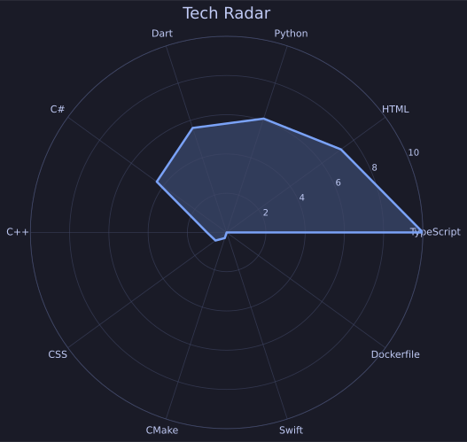

<section align="center">

  <h2 align="center" class="heading-element" dir="auto"> About Me </h2>
  
  
 My name is Suna and I'm a computer engineer student.

  
 I'm sharing my own learning process.

   

</section>

<section align="center">
  <h2 align="center">Code Constellation</h2>

  
   
</section>

<!--
<section align="center">

  <h2 align="center" class="heading-element" dir="auto">GitHub Stats</h2>
  

 

 
</section>
-->
